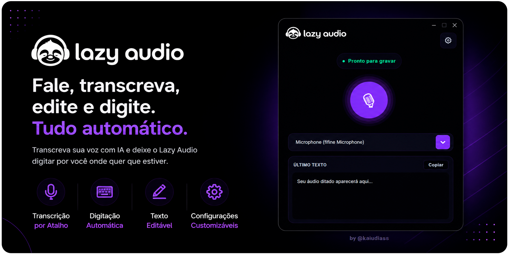

# Lazy Audio 🎙️

O Lazy Audio é uma aplicação desktop moderna desenvolvida para transformar sua voz em texto de forma ágil e inteligente. Utilizando uma interface elegante (CustomTkinter) e o poder da IA local (Faster Whisper), o aplicativo permite gravar a sua voz, transcrevê-la automaticamente e digitar o resultado em qualquer lugar do seu computador!

---

## 🚀 Como Instalar e Rodar (Mais Fácil)

[**📥 Baixe a versão mais recente aqui (v1.1.0)**](https://github.com/kaiudiass/Lazy-audio/releases/tag/v1.1.0)

### 🪟 Para Windows
1. Baixe o arquivo [`LazyAudio-Windows.exe`](https://github.com/kaiudiass/Lazy-audio/releases/tag/v1.1.0).
2. Dê um duplo clique para abrir.
   - *Nota: Caso o Windows SmartScreen exiba um alerta azul, clique em "Mais informações" e depois em "Executar mesmo assim".*

### 🐧 Para Linux
1. Baixe o arquivo [`LazyAudio-Linux`](https://github.com/kaiudiass/Lazy-audio/releases/tag/v1.1.0).
2. Abra o terminal na pasta onde baixou e dê permissão de execução:
   ```bash
   chmod +x LazyAudio-Linux
   ```
3. O aplicativo precisa colar texto e ler o teclado globalmente. Instale os gerenciadores de área de transferência do Linux (se já não tiver):
   ```bash
   sudo apt install xclip wl-clipboard
   ```
4. Em seguida, rode o aplicativo como administrador (necessário para ler o teclado globalmente no Linux):
   ```bash
   sudo ./LazyAudio-Linux
   ```

---

## ✨ Funcionalidades (Como funciona)

O Lazy Audio foi pensado para economizar seu tempo. Veja como usar cada recurso:

- **🎙️ Transcrição por Atalho de Teclado:**
  Pressione e segure a **tecla de ativação** (o padrão é `Right Shift`, mas você pode mudar nas configurações) enquanto fala. Quando você soltar a tecla, o áudio será processado e transformado em texto pela IA!
  *(Você também pode simplesmente clicar no botão redondo do microfone na tela para iniciar e parar).*

- **⌨️ Digitação Automática (Auto-Type):**
  A mágica principal: assim que a transcrição terminar, o Lazy Audio vai colar e digitar automaticamente o que você falou onde quer que o seu cursor de texto esteja ativo (no Word, WhatsApp, Navegador, etc).

- **📝 Área de "Último Texto" Editável:**
  Se a IA cometeu algum pequeno erro de pontuação, você não perde o texto! A caixinha principal do aplicativo exibe sua última fala. Você pode **editar as palavras ali mesmo** e clicar em **Copiar** para pegar o texto corrigido.

- **⚙️ Configurações Customizáveis:**
  Clique na engrenagem no topo para abrir as configurações:
  - **Idioma da Voz:** Escolha se vai ditar em Português, Inglês ou Espanhol.
  - **Tecla de Ativação:** Escolha qualquer tecla do seu teclado para ser o "gatilho" do microfone.

---

## 🛠️ Para Desenvolvedores (Rodando do Código Fonte)

Se você quiser modificar o código ou contribuir, pode rodar o projeto via Python:

### Pré-requisitos
- Python 3.8 a 3.11 instalado.
- (Apenas Linux) Instalar dependências do sistema: `sudo apt-get install portaudio19-dev python3-tk scrot`

### Instalação
Abra o terminal na pasta raiz do projeto e instale os requisitos:
```bash
pip install -r requirements.txt
```

### Execução
Inicie o aplicativo rodando o arquivo principal:
```bash
python main.py
```

---

## 📁 Estrutura de Pastas

- `core/`: Lógica de gravação de áudio (`audio_recorder`) e modelo de transcrição via IA (`transcriber`).
- `image/`: Armazenamento de imagens, ícones e assets visuais.
- `temp/`: Arquivos temporários durante a execução (o arquivo `.wav` gerado antes da transcrição).
- `tools/`: Scripts utilitários.
- `ui/`: Componentes da interface de usuário (`app.py`, `settings.py`, canvas do microfone).
- `config.py`: Arquivo global de cores, temas e caminhos.
- `main.py`: Ponto de entrada da aplicação.
- `build.spec`: Receita de compilação para o PyInstaller.
- `.github/workflows/`: Robôs de automação que geram os executáveis no GitHub.
